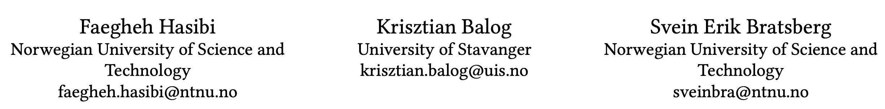
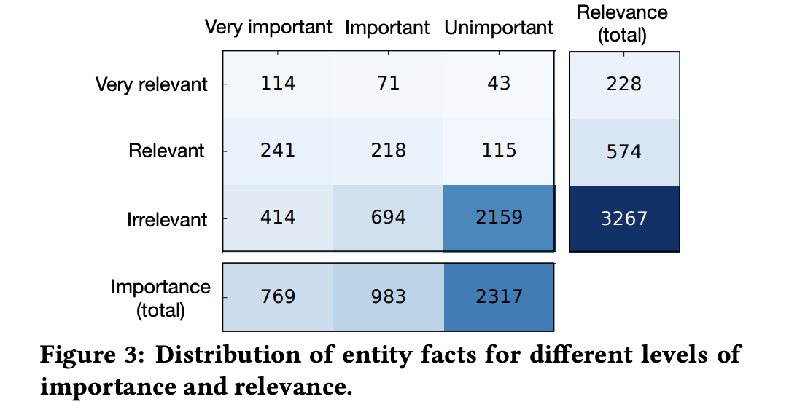
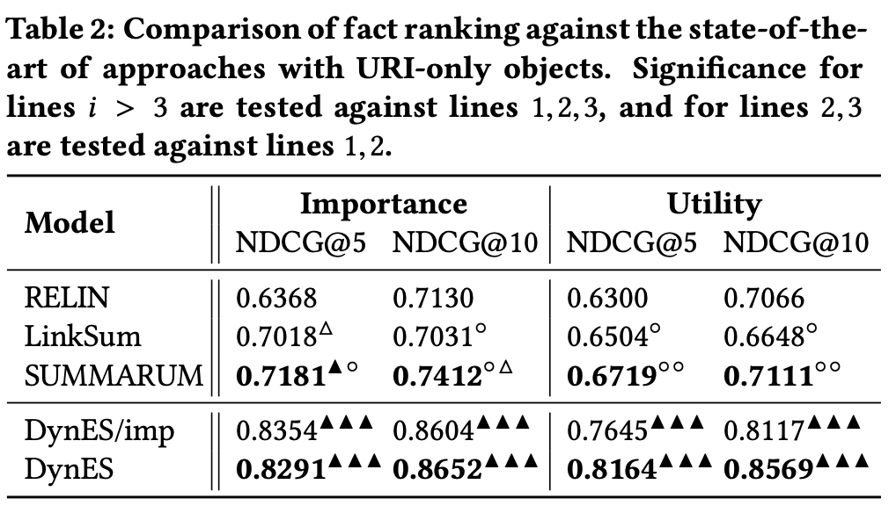
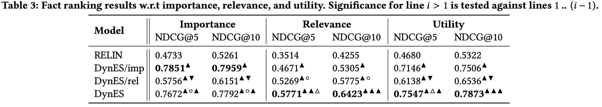
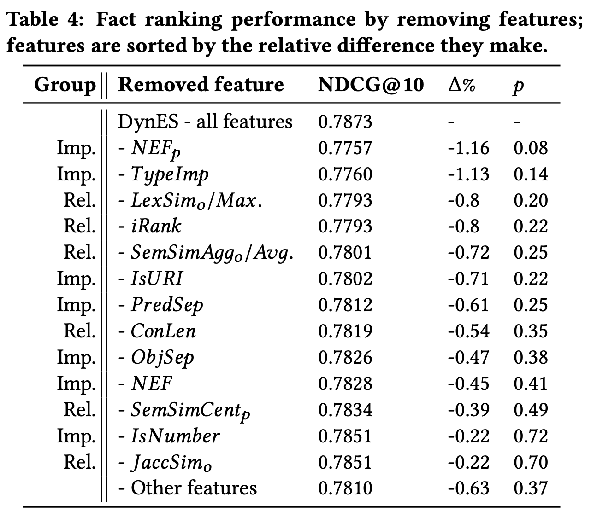
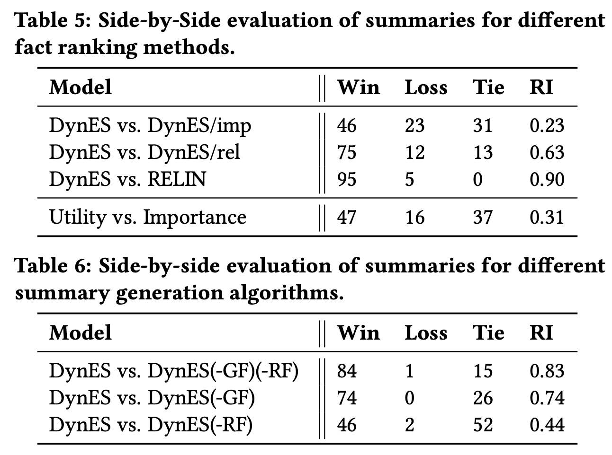
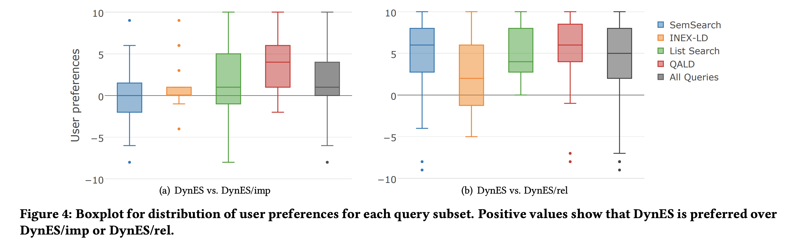

# 2017_Dynamic Factual Summaries for Entity Cards
pdf : https://hasibi.com/files/sigir2017-dynes.pdf   
SIGIR 2017 

## 著者 (所属)

## どんなもの?解きたい問題?
- 動的エンティティカード生成の論文
- エンティティカードに対する事実の要約をどのように生成し、評価するか？
- ポイント
    + 重要度(一般的に出しておきたい基本情報)と関連度(ユーザが調べたクエリに対してどれだけ関連しているか)
    + ファクトを列挙する以上に、同義(ウェブサイトとホームページなど)・多値(子供)やデバイスごとの表示制約
    + エンティティカード全体の品質評価

## 先行研究と比べてどこがすごい？
- エンティティカードの動的要約(基本情報)の生成と評価に関する最初の論文
- DynES 動的エンティティカード生成のためのアプローチを考案
- ファクトランキングのベンチマークとして、クラウドソーシングにより得られた約4000のエンティティファクトの判定結果を利用できるようにした
- ファクトランキングベンチマークによる評価 & ユーザ嗜好調査

## 技術や手法のキモはどこ？
### 前提の説明
KB(ナレッジベース)では、実体は主語-述語-目的語（s,p,o）のトリプルの集合で扱われる。

1. fact
    + 述語-目的語の組。
    + エンティティeに対するファクトの集合は、`Fe = {<p,o> | <s,p,o>,s = e}`
        * -> 複数の対象を持つ述語が集まって構成される
2. 重要度
    + そのエンティティを記述する上での、そのfactの一般的な重要度を表す。
3. 関連性
    + factがクエリにどれくらい関連しているか
4. ユーティリティ、効用
    + factの一般的重要性と関連性を、両者の重み付き組合せ（両者は同じ尺度であると仮定）により、一つの数値にまとめたもの
    + `uf ,q = αif + βrf ,q `で表現
    + 本論文ではα=β=1
5. factランキング
    + factと検索クエリの集合を入力とし、ある基準（重要性、関連性、またはユーティリティ）に関して順序付けられたfactを返すタスク
    + このランキング通り出すだけだと、同義・多値述語・表示制約などあり十分でない -> 6.要約生成
6. 要約生成
    + Feのランク付けされたリストを入力として、ユーザ満足度を最大にするような、与えられた最大サイズ（高さと幅）の要約を構築する

### DynES（Dynamic Entity Summarization）
factランキング生成 & 要約生成する手法  

#### fact ランキング生成
- 各factとクエリの組（f ,q）を特徴量に変換 -> ランキングのスコアを出力
- 重要度と関連度を等しい重みで考慮する
- 名前付きエンティティクエリから冗長な自然言語クエリまで、様々な種類のクエリを扱えるように設計  

1.重要性を捉えるために設計した特徴量
+ 正規化fact頻度
    + そのfactの頻度を全fact数で割ったもの
+ 正規化entity頻度
    + あるfactを含むエンティティの頻度を全エンティティの数で割ったもの
+ タイプベースの重要度
    + entityタイプごとのpの頻度
+ Predicate特異性
    + oは多頻出だがpが稀少なfactを識別する指標
+ Object特異性
    + pは多頻出だがoが稀少なfactを識別する指標
+ その他
    + oが数値か否か
    + oが他のEntityを指すURIかリテラルか
    
2.関連性を捉えるために設計した特徴量
- Context length
    + 検索クエリ内のどのエンティティにもリンクされていない用語の数
- Semantic similarity
    + q-p、q-oの組の意味的類似性
- Lexical similarity
    + q-p、q-oの組の文字の編集距離
- Inverse rank
    + クエリに対して関連のあるエンティティランキングを生成、とあるoをもつエンティティ順位の逆数
    + qに対してそのoがどのくらい関連するのかを測定

#### 要約生成  
出来てるポイント
- 与えられたサイズの要約を作成
- 同義factまとめ、不要fact削除
- 多値述語を処理  

システム
- 入力: ランク付けされたエンティティfactのリスト、entity表示エリアの高さと幅の最大値  
- 出力: 最大高に合わせた要約の行
    + 見出しを持つ
    + 最大幅の文字を持つ1つ or 複数の値
- 処理
    + Predicate-Name Mapping
        * 同一のpredicateを認識し、正規の名前にマッピング(dbo:BirthDate = dbp:DateOfBirth)
        * 同一とみなす基準は「複数形であること」 or 「object valueが完全同一 かつ predicate名が部分一致」
    + 各要約行のkey選択
    + 各行のvalue選択
        * 最大幅におさまるvaleを連結
    + 見出し + 行が最大高を超えないように連結

### ベンチマークデータの作成
#### 元データ
- KB
    + DBpedia (ただし、タイトルと短い抄録を持つもの限定)
    + 要約以外のデータを削除
    + 数字や一文字からなるノイズの多いpredicateの削除
    + 最低5つ有効なpredicateをもつエンティティのみにする
- クエリ
    + DBpedia-entity dataset
    + 全485個
    + 4カテゴリ
        + エンティティ名
        + 複数エンティティ名のリスト
        + 文章
        + タイプ/関係/属性を含む(vietnam war facts, england football player highest paid)

#### エンティティ - クエリペアの作成  
※エンティティ検索タスク自体には注目していない  
-> いくつかのアプローチを組み合わせて、特定の検索手法に特化しないようなペアを作る  
- 6種類の検索手法(BM25、BM25F-all、SDM、FSDM、SDM+ELR、FSDM+ELR)
- すべてのメソッドで平均的に最も高い順位で出力されたエンティティを1つ選ぶ
- 4クエリカテゴリに25ずつ合計100個のペアを用意
- 合計約4000fact

#### factランキングテストセットの作成
- クラウドソーシング
- エンティティに対する各factの重要性を3段階評価
- クエリに対する各factの関連性を3段階評価  

- 関連性は、5%のfactが強い関連ありと評価
- 最も相関が高いのは、クエリに関連なし かつ エンティティに重要でない
- 最も相関が低いのは、クエリに関連あり かつ エンティティに重要でない
- 重要度（3段階），関連性（3段階），utility（5段階）でラベルを作成

## 実験
### factランキング
(RQ1) 我々のファクト・ランキング・アプローチは最先端の技術に対してどのように比較されるか？    
(RQ2) 重要性、関連性、効用に関して、ファクト・ランキングの性能はどのように比較されるのか？

----

- ベースラインシステムとDynES、DynES/impを重要性と効用の観点から比較
- ファクトランキングは全てのベースラインより有意に高いパフォーマンス
- ベースライン手法では重要度に関しては有意であっても、効用に関しては有意な差異がない

※RELINは実用性の点で他のシステムと同等であるため、残りの実験ではRELINをベースラインとして選択

----

- RELIN、DynES/imp(factの重要性のみを捉えるように設計): 重要性 > 関連性・有用性   
- DynES/rel、DynES: 重要性 < 有用性  
 
=>   
(i)fact - クエリの関連性を捉えるには、factの重要性とは異なる処理と特徴量が必要である。  
(ii)関連性の側面を捉えることは、重要性よりも難しい

----

- 特徴量を1つだけ消した時のランキング性能  
- 重要度や関連性の高い特徴量は、最も重要な特徴量に均等に分布

### 要約生成
(RQ3) ユーザーは様々な種類の要約にどの程度満足しているか？  
(RQ4）我々の要約生成アルゴリズムはどのようにユーザーの好みに影響を与えるか？

----
  
- 重要性と関連性の両方がエンティティ要約に必要
- 静的な重要度・関連度ベースの方法より、効用ベースの動的生成の方が良い
- 多値述語のグループ化（GF）は、同義factまとめ（RF）よりも重要である

----

- DynESを選択したユーザーの数
- 効用ベースの要約は関連性ベースの要約より全体的に好まれている
- 複雑なクエリであるListSearchとQALDが最も恩恵を受けている

## 感想
- 次読む
    + https://www.semanticscholar.org/paper/Entity-Summarization-with-User-Feedback-Liu-Chen/e5540eba384fc900f9cdb9723fbc7ea8da68f23b
