# Unbiased Learning-to-Rank with Biased Feedback
pdf : https://dl.acm.org/doi/pdf/10.1145/3018661.3018699  
WSDM 2017 best paper

## 著者 (所属)

## どんなもの？ (解きたい問題)
- 検索結果のクリックからランキング学習をする時いろんな制限がある
    + positionバイアス
    + バイアスだけ意識すると、あとの順位のものが強くなりすぎる
    + データが少ないすぎて難しい
    + ランキングをランダム表示にしてデータを集めるといったやり方はサービス品質を落とす
- これらを克服してバイアスを取り除いたランキングモデルを作りたい
- 傾向スコアを用いたPropensity-Weighted Empirical Risk Minimization アプローチ
- Propensity SVM-Rank

## 先行研究と比べてどこがすごい？
- これまでのLTRにおける代表的なバイアス除去方法
    + ユーザ行動をモデル化し、収集データのバイアス効果を最小化するようにデータ解釈する
    + ユーザにランキングを提示するときに恣意的な介入を行い、データ収集時にバイアスの混入が少なくなるようにしたもの
- データ収集時にランダム化したランキングを提示せず、行う(多少ランキングへの介入はあるけど...)
- シンプル
- 多くのデータを必要としない（=テールクエリにも有効である）
- バイアス、ノイズなどに対してロバスト

## 技術や手法のキモはどこ？
### LTRの復習(feedbackデータなしのとき)
損失関数  
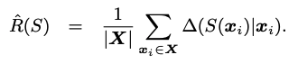  
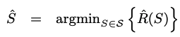
- x: クエリ
- X： クエリサンプルの集合
- S: ランキング
- ∆(S(xi)|xi): 損失  

すべてのドキュメントに対する関連性rel(x,y)は既知である   
クエリxに対する任意のランキングの損失も計算できる  
という前提に基づく。

### 提案手法
損失関数  
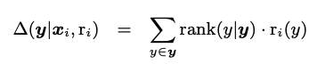  
ips推定量  
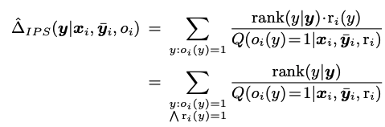
- x: クエリ
- y: ドキュメント
- ri: ユーザ固有に決定される関連性(0 or 1)
- oi: アクションが観測されたか否か(0 or 1)
- Q(oi(y)= 1|xi, ybar_i, ri): 条件下でアクションが観測される条件つき確率(傾向スコア)

傾向スコアは観測可能なデータのみに依存している。  

### クリックモデルに応用
#### 簡易的なクリックモデル
クリックされる確率(傾向スコア)  
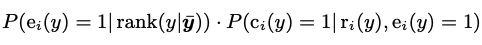
- y: ドキュメント
- ei: ユーザがyを見たか否か(0 or 1)、yのランクに依存する
- ci: ユーザがクリックしたか否か(0 or 1)
- P(ei(y) = 1| rank(y|y¯i)): とあるpositionのドキュメントを見る確率
- P(ci(y) =1| ri(y), ei(y) = 1): 調べた結果をクリックする確率

完全にノイズがない(ユーザの押し間違いがない)と仮定するとci(y) = 1 ↔ [ei(y) = 1 ∧ ri(y) = 1] 。  
モデルで必要なのは"とあるpositionのドキュメントを見る確率(pr)"の方になる。  

提案手法のIPS推定量の式に当てはめると下記の感じ。  
"とあるpositionのドキュメントを見る確率(pr)"さえ分かってしまえば、損失が割り出せる。
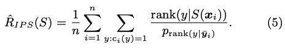

#### prを推定する
prを推定するためにユーザに対してランダムに並び替えた検索結果を見せる -> ユーザ体験が損なわれる  

そこで、  
r番目のドキュメントと「ランドマーク」となるk番目のドキュメントの表示を入れ替え、CTRを取得する。  
kを固定してk以外の全てのrとのCTRの比を出し、これをprとする。   
※prに定数がかかっていても損失の大小関係に変化ないので  
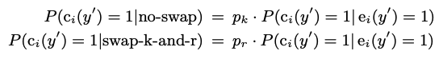

### PROPENSITY-WEIGHTED SVM-RANK
具体的な学習法について  
下記の最適化問題に問題を置き換える    
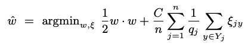
- qj: 傾向スコア

## どうやって有効だと検証した？
### Yahoo Learning to Rank Challengeデータを使った検証
- 利用データ: Yahoo Learning to Rank Challengeコーパス
    + クエリとドキュメントのセット
    + 人手で関連性がラベリングされてる

擬似的なクリックデータを作成(trainingデータ)
- ラベリングされているデータで通常のRank SVMを生成(プロダクションランカー)
    + ランキングを作成する役
- プロダクションランカーのランキングと人手のラベルから傾向スコアを算出、クリック確率とする
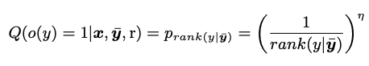
- η: positionバイアスを厳しくするためのパラメータ

- そのほかの設定
    - Naive SVM Rank(qj = 1に設定)とどの程度性能が改善されているか比較
    - 各種パラメータはクロスバリデーションで算出
    - テストはラベリングされた結果 
- 評価は下記で行う  

#### 実験結果
##### 学習データが変化した時の学習率
Clipped ~は傾向スコアが小さくなりすぎた時に定数で置き換える手法
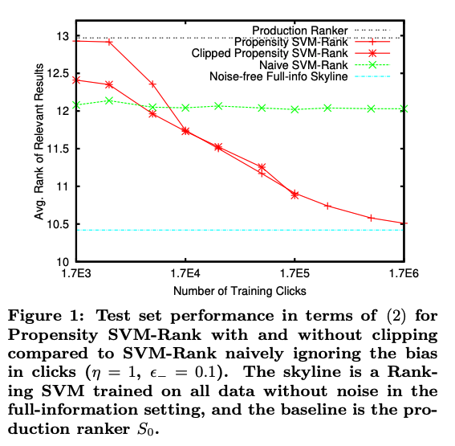

##### バイアスの厳しさの度合いを変えた時
5x ~ はトレーニングデータの量を5倍にしたもの  
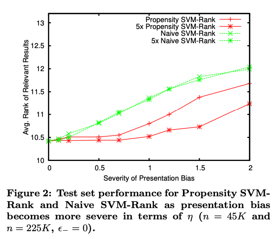

##### クリックノイズの割合を変化させた時
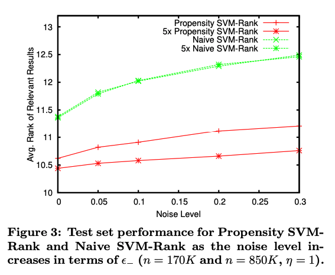

##### 誤った傾向スコアにどれだけ強いか
学習時はη = 1で学習させ、テストデータは各々ηを変化させている  
positionバイアスを小さめに見積もってしまうと精度が著しく悪化することを示している  
-> 実際に使う時は大きめに見積もった方がいい？  
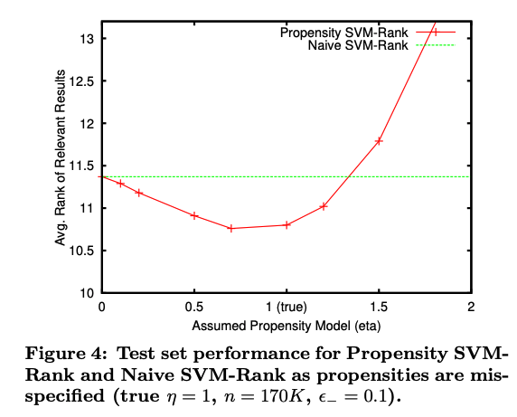

### Arxiv Full-Text Searchでの検証
- 表示順位入れ替える工程を7日間
    + トップランクのドキュメントをランクj∈{1, ... ... 21}のドキュメントと入れ替え
    + 1位を1としたときのCTRの比を算出
    + 順位＞21の場合は、pr＝p21にする
- 21日間のクリック数を観測
    + 16日間(5437クリック)が訓練データ
    + 5日間(1755クリック)がテストデータ
- 最適なハイパーパラメータの設定で、21日分のデータを使って再トレーニングを行い、いずれの手法でも最終的なwを決める
- valanced interleaving(現行モデル、naiveと比較)  
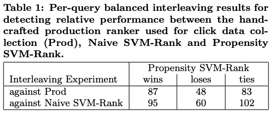  

## 次に読むべき論文は？
どうやってpositionバイアスを出すか
- Position Bias Estimation for Unbiased Learning to Rank in Personal Search
- Unbiased Learning to Rank with Unbiased Propensity Estimation
