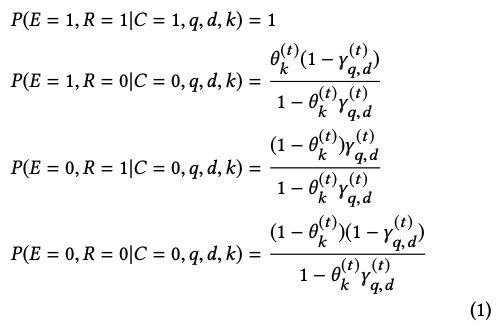

# 2018_Position Bias Estimation for Unbiased Learning to Rank in Personal Search
pdf : https://static.googleusercontent.com/media/research.google.com/ja//pubs/archive/46485.pdf  
WSDM 2018

## 著者 (所属)

## どんなもの？ (解きたい問題)
- クリックデータを活用
- 個人検索にフォーカス
- 様々なバイアスを取り除いたランキングを作成する(Unbiased Learning to Rank)
- ~~クリックバイアスを考慮に入れて、⟨クエリ、ドキュメント⟩の関連性を推定~~ -> クリックバイアス自体を定量化することが重要な要素
- 既存のバイアス定量方法
    + クリックバイアスの定量化に際し、ユーザにランダム化したランキングを提示する
    + ユーザ体験の品質を損なう
- ランダム化を伴わずに、クリックバイアスを求めたい！
- 回帰ベースのEMアルゴリズムを提案

## 先行研究と比べてどこがすごい？
- バイアスを決めるにあたり、ランダム化を必要としない
- バイアスの変化にも対応できる

## 技術や手法のキモはどこ？
### UNBIASED LEARNING-TO-RANK
#### 既存のバイアス補正方法  
**Query-level propensity**    
  

- q: クエリ
- O: 事象を観測したか
- ri∈{0,1}: ドキュメント-クエリに関連があるか
- π: ドキュメント集合

クリックで考えてみると、関連ドキュメントが下位にランク付けされているクエリはクリックされずデータに入りにくい。  
あるクエリがデータに残されるかどうかは、関連ドキュメントの最高位に依存している。   
-> 複数の関連ドキュメントがあるクエリには微妙 

**Document-level propensity**  

wをIPWと言う。

### PROPENSITY ESTIMATION
どうやってpropensityを計算するか？？  
#### Position Bias Model
クリックは、"ある位置ドキュメントを見る確率"と"クエリ-ドキュメントが関連する確率"に依存して行われるとするモデル  

- d: ドキュメント
- q: クエリ
- k: 位置
- E: ドキュメントを見るか
- R: ドキュメント-クエリに関連があるか

このPosition Bias Modelを上記のpropensityの式に当てはめてみる。  
E=1のとき、RはCによって完全観測され、O=1  
傾向P(O=1)を推定することは、見る確率P(E=1)を推定することに等しい -> P(E=1)を導き出し、バイアス補正に使おう！

以降下記のように扱います。  

#### ランキングのランダム化
θkを推定するには、γq,dを推定するか、式から排除するかしかない。  
既存手法ではバイアス定量に際し、提示ランキングのランダム化を行ってしまう。  
以下2つの代表手法。  

1. Randomize TopN(RandTopN)  
上位N個のドキュメントをランダムにシャッフルしてユーザに提示する。  
繰り返すことで関連ドキュメントがいろんな場所に出現して、結果として関連性と独立した相対的な位置バイアスが推定できる。  

2. Randomize Pair(RandPair)  
ランク1とランクkのドキュメントの位置を交換してユーザに提示する。  
ペアをちゃんと構成すれば、クエリ-ドキュメントの関連しているか否かの影響を除くことができ、相対的な位置バイアスがわかる。  
※ 本論文では、k-1位とk位の隣接するペアをランダムに入れ替える方法にしている  

#### 既存手法の比較
Position Bias Modelは、単純すぎるのでうまくいかないかも？  
ランダム化はどのくらいユーザーに悪影響なの？

1. 2つの手法(RandTopN・RandPair)におけるバイアスθkの比較  
  
-> 両手法で大体同じ値だからPosition Bias Modelが大幅に間違っていることはなさそう

2. 2つの手法でクリックされた位置の MRR（Mean Reciprocal Rank）への影響を定量化 vs 通常のランキング  
  
-> RandTopNはランダム化が激しいので悪め。RandPairの下位のデータは、ユーザーバケットの分散が大きくクリック数が少ないことに起因。

Position Bias Model自体に問題はなさそうだが、やはりランダム化は悪影響がある。  
-> ランダム化せずにバイアス定量する

### 提案手法
通常のクリックログL = {(c,q,d,k)}が与えられた場合、このデータを生成される対数尤度は下記。  
EMアルゴリズムで、データ全体の対数尤度を最大にするパラメータを見つける。  

#### 標準的なEMアルゴリズム
- Eステップ  
1個前の周回からのパラメーター{θ(t)k}と{γ(t)q,d}で隠れ変数EおよびRの分布を推定。  
クリックデータLとE、RとでP(E=1|c,q,d,k)とP(R=1|c,q,d,k)を計算。  

- Mステップ  
EステップからのP(E=1|c,q,d,k)とP(R=1|c,q,d,k)を使ってパラメーター更新。  
  

Mステップでは、関連がある(q,d)セットを用いている。  
これは、プライバシーの問題、クリックデータは非常に疎でノイズが多いなどなどの理由で用意できない可能性。  

#### 回帰ベースのEMアルゴリズム
(q,d)セットを扱う代わりに、それらを表す特徴ベクトル(xq,d)があると仮定。  
Mステップの式を、関連性γq,d=f(xq,d)を計算する関数に置き換える。  
ちなみにxqには、位置データの他にランキング特徴量を盛り込むのもok。

主な変更点  
- MステップのP(R=1|c,q,d,k)を、関連性rに変換する
- (今回は)GDBTを経由して、f(xq,d)を作成。  

## どうやって有効だと検証した？
### データ
- 電子メールサービスとファイルストレージサービスの両方の検索ログ
- クリックされてないクエリはすべて捨てる
- 2017年4月の2週間
    + 最初の1週間のデータをトレーニングに、2週間目をテストに。
    + 各週には約4Mのクエリ
- 各クエリには約5つのドキュメントが提示される
- クリックログ以外に、サービスの既存のランキング特徴量を使用

### 比較手法
Embedded法  
位置を特徴として入れたCTR予測モデル。  
クリックデータの尤度を最適化するために、識別モデルGDBTを学習させた。  
位置データの効果を他の特徴量から切り離すため、split depth=1にする。

### 評価指標
#### MRR
  
  
- rank_i: i 番目のクエリのクリックされたドキュメントのランク

#### 平均対数尤度
 

### 結果
#### バイアスについて  
- 対数尤度の結果  
  

- MRRの相対的な差(各手法 vs ベースライン)    
    + ベースライン: ランキング特徴量のみを入れた、ポイントワイズGBDTモデル  
  
-> 対数尤度に差がなかったが、EM法のほうが特徴量を効果的に使えている。

- バイアスθkの値
    + Emprical: トップを1とした時のクリック数の比  
  
-> EM法はEmbedded法よりもRandPairに近い  

#### ランキングについて
- ランキングMRR  
    + NoCorrection(ベースライン): バイアス補正を行わないlambdaMART  
    + RandPairCorrected: RandPairから推定されたバイアスを使用 
    + EMCorrected: EM法で推定されたバイアスを使用  
  

- ポイントワイズ学習におけるMRR(各手法 vs ベースライン)      
クリックなしドキュメントのOが必要なため、IPWはポイントワイズ学習に直接使えない。  
そのため下記のような補正を行ってテストする。 
    + QueryLevel: クリックされていないドキュメントもクリックされたドキュメントと同じIPWの重みを持つ  
    + DocLevel: クリックされた/されていない両ドキュメントについてoi=1と仮定  
  
-> EM法ならポイントワイズ学習にも使える。ただしペアワイズの方が優秀。

- EM法の収束速度  
最初の反復に対する相対的なMRR(電子メールデータ)  
  
-> 素早く収束する

