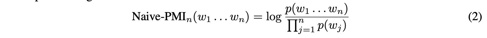
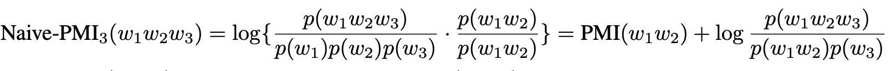
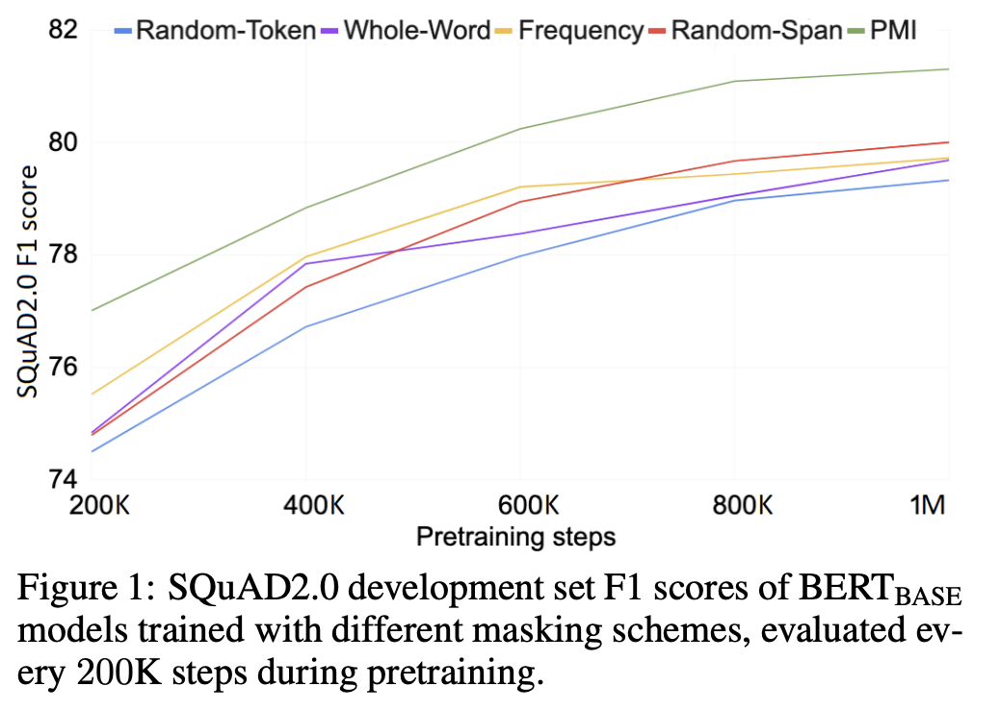
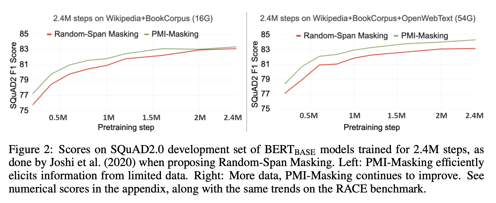
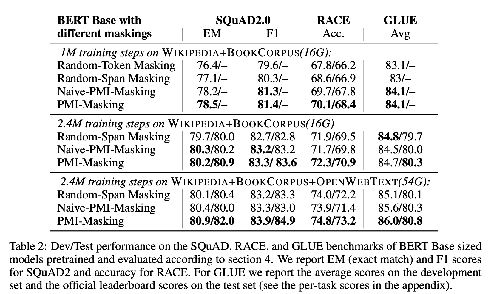
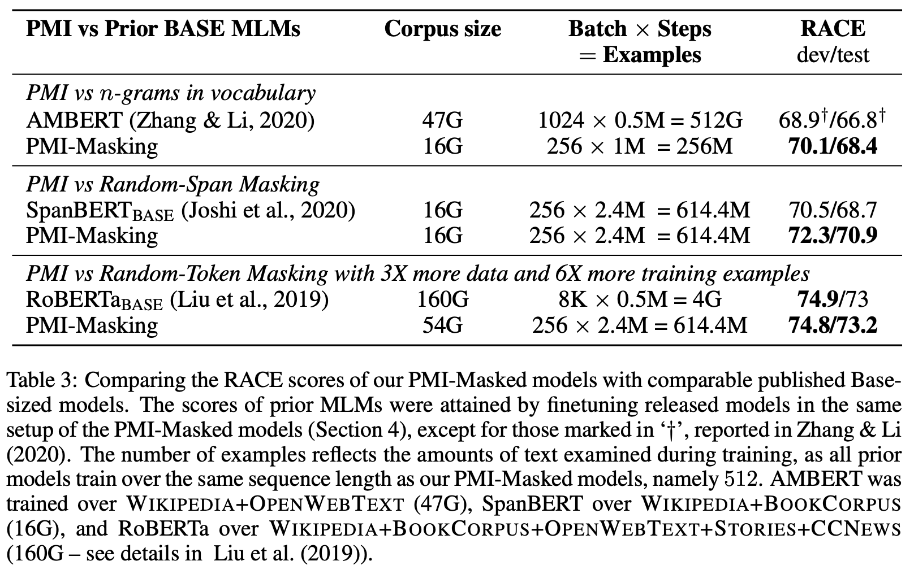
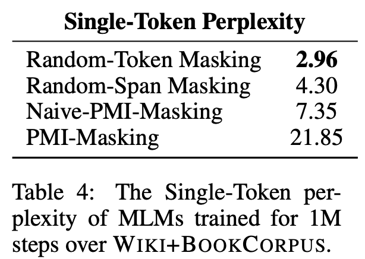

# 2021_PMI-MASKING: PRINCIPLED MASKING OF CORRELATED SPANS
pdf : https://arxiv.org/pdf/2010.01825.pdf  
ICLR 2021

## 著者 (所属)

## どんなもの？ (解きたい問題)
- Masked Language Models（MLM)
- 学習時にトークンをランダムマスクする手法が広く使われるが最適な手法とはいえないのでは？
    + (例) 「最大の固○値に対応する固有ベクトルを使用する」-> 文全体でなく"固有値"という局所的なattentionで予測可能
- PMI-Maskingを提案
    + Pointwise Mutual Information (PMI)を用いて頻繁に共起するn-gramグループを識別し、共同でマスク

## 先行研究と比べてどこがすごい？
- 既存手法の半分の時間で、既存手法程度の性能にまで到達可能
- 性能自体の向上

## 技術や手法のキモはどこ？
### 既存手法
| 手法名| 内容 | 問題点 |
|:-------------------------------------- |:-------------------------- | :----------- |
| Random-Token Masking                   | トークンをマスク                                                                     | 局所的なattentionで予測  |
| Whole-Word Masking                     | 単語全体をマスク                                                                     | 単語同士の共起は拾えず、局所... | 
| Knowledge Masking, Salient Span Masking| 外部パーサーにより識別したエンティティやフレーズを構成するトークンを共同でマスク     | 相関を持つN-gramの種類が限定 & パーサーが微妙であんまり恩恵がなかった |
| Random-Span Masking                    | テキスト中のランダムな位置で幾何学的分布からサンプリングした長さの単語spanをマスク   | 頻繁に共起する単語がちぎれる可能性 |

### 提案手法
#### PMI: FROM BIGRAMS TO n-GRAMS
PMIとは、2つの事象が独立である場合に期待される頻度と比較して、どの程度発生するかを定量化するもの  
bi-gramだと下記のような感じ。  
  

純粋な頻度とは異なる。  
(例) WIKIPEDIA+BOOKCORPUSデータセットでは、"book is"というbigramは34772回出現、"boolean algebra"は849回出現。しかしPMIは"boolean algebra"の方が大きい。

n-gramだと下記のような感じ。  
  

N-gramの中にPMIが高いセグメントがあると、そのセグメントがN-gramの残りの部分と相関がなくてもNaive-PMInは高くなってしまう問題がある。    
  
PMI(w1,w2)さえ高ければw3が何であってもNaive-PMI3は大きな値となる。  
(例) "Kuala Lumpur" のPMIは非常に大きく、"Kuala Lumpur is"も大きな値となる。"editor in chief"みたいな明らかな共起語より高いスコア。  

N-gramのすべての確率に対して評価
  
- seg(w1 … wn) : 連続するすべての分割の集合
    + (例) ["Kuala Lumpur", "is"], ["Kuala", "Lumpur is"], ["Kuala", "Lumpur", "is"]
- σ∈seg(w1 . . wn) : 1つサブスパン

#### PMI-MASKING
共起性の高い(PMIn指標の大きい)n-gramを抽出してマスキングリストを作成
- コーパスに10回以上出現する長さ2-5の単語n-gramを対象
- PMInはn-gramの長さに依存するため、n∈{2, 3, 4, 5}ごとに長さごとのランキングを作成しそれらを統合
- マスキング語彙のサイズを800Kとし、事前学習コーパストークンの約半分が何らかの相関を持つn-gramの一部として同定

上記のリストを基本的なマスキング単位として扱う  
リストにないすべての入力トークンは、Whole-Word Maskingに従ってマスキングの単位として扱われる  
(例) 入力テキストが「by the way out」、リストに「by the way」と「the way out」があるとき、「by the way」と「out」または「by」と「the way out」がマスク対象  

マスキング
- 入力トークンの15%をランダムに選び、マスキング対象とする
- 先行手法と同様に、MASK(80%)、ランダム(10%)、オリジナル(10%)のトークンへの置き換え

ちなみに、リストの中身はどんなだったか...  
- Bigrams/Trigramsリストのうち、Entityとしてアノテーションされたものは約14%
- bigramのPMI上位20%のうち50%がEntity。trigramについても同様の傾向
- Entityの割合は全体の約1/7でEntityでない共起セットをかなり拾っている

## 実験

### 設定
比較手法  

| 手法名                  | 内容                                                                                                                  |
|:---------------------|:--------------------------------------------------------------------------------------------------------------------|
| Random-Token Masking | 入力トークンの15%をランダムに選び、マスキング対象とする。MASK(80%)、ランダム(10%)、オリジナル(10%)のトークンへの置き換え。                                            |
| Whole-Word Masking   | 単語レベルで分割。masking budgetに達するまで対象を選ぶ。単語をマスキング単位として上記と同じ割合で置き換え。                                                       |
| Random-Span Masking  | 連続するランダムな単語を15%のmasking budgetに達するまで選択。スパン長(単語長)は幾何分布l 〜 Geo(0.2)からサンプリングされ、10単語を上限とする。スパンをマスキング単位として上記と同じ割合で置き換え。  |
| Naive-PMI-Masking    | Naive-PMIn指標でランキングを作成し、上位をマスキング対象の語彙とする。これをマスキング単位として上記と同じ割合で置き換え。                                                  |
| Frequency-Masking    | 純粋な出現頻度でランキングを作成し、上位をマスキング対象の語彙とする。これをマスキング単位として上記と同じ割合で置き換え。                                                       |

処理
- 事前学習
    + WordPiece Tokenizerを介してWIKIPEDIA +BOOKCORPUS上で構築した30Kサイズの語彙
    + Next Sentence Predictionタスクは省略
    + シーケンス長512トークン、バッチサイズ256、ステップ数を変化させながら学習
- fine tuning
    + Stanford Question Answering Dataset (SQuAD) 
    + ReAding Comprehension from Examinations (RACE)
    + General Language Understanding Evaluation (GLUE) 
    
| 名| 内容 |
|:----- |:-------------------------- |
| SQuAD | 質問応答ベンチマークとして利用されている。文脈と質問が提供され、文脈から関連する部分を抽出して質問に答えるというタスク|
| RACE  | 英語試験から収集された大規模な読解データセット。各パッセージには複数の設問があり、それぞれ4つの選択肢から1つの正解を選ぶというタスク|
| GLUE  | 自然言語理解システムを評価するための9つのデータセット集。2つの文章の意味が同じかなど様々な言語理解タスクが入ってる|

### 結果
#### 事前学習のステップ数を変えて下流タスクを評価してみる
 
- 他の方法より効率よく事前学習が進んでいそう
- SQuAD以外でも同じような傾向

 
- Random-Span Maskingを提案された際の設定で行ってみると、PMI-maskingの方が学習速度が速いものの、最終F値は同じくらい
- OPENWEBTEXTコーパスを追加し、学習データ量を増やしてみるとRandom-Span Maskingは追いつけなくなった

#### 下流タスクの最終性能を比較してみる
masking手法で比較  
 
- 他のmasking手法と比べると、提案手法での性能が高い
- より大きなコーパスで事前学習を行った場合すべての指標で提案手法が勝っている

bert手法で比較  
 
- 他のbertモデルとも比較
- RoBERTaでは3倍大きなコーパスで例も6倍となるが提案手法の勝ち

ちょっとそれますが...  
 
- 事前学習の時点で予測性能が低くても下流タスクの性能が低くなるとは限らない

## 感想
- シンプルで強い
- PMIのn-gramの拡張はbert以外のところにも使えそう
