# 2021_Rotom: A Meta-Learned Data Augmentation Framework for Entity Matching, Data Cleaning, Text Classification, and Beyond
pdf : http://www.miaozhengjie.com/pdf/rotom-sigmod21.pdf  
sigmod 2021 

## 著者 (所属)
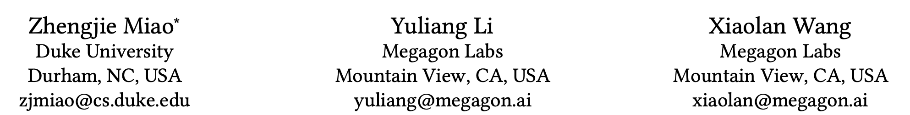

## どんなもの?解きたい問題?
- 少ないラベル付きデータ(200件とか)で高品質のdnnモデルを実現したい
- Rotom
    + data argumentationを取り入れたフレームワーク
    + Meta学習
    
## 先行研究と比べてどこがすごい？
- 一般的なdaでは、分類ラベルを保持したままデータをちょっと編集 -> 複雑なデータを作り出す
- ラベル無しデータを利用することができる(半教師あり学習)
- 性能も改善

## 技術や手法のキモはどこ？
### 1.前提(Rotomで扱うタスク)
Rotomで扱えるのは、一般的な多クラス配列分類のタスク.

本論文で扱うもの
- Text Classification
- Entity Matching
  + 2つのEntityが一致するか
- Error Detection
  + テーブルデータが与えられた時、タイプミス、データフォーマットのエラー、制約違反などのエラーが含まれるセルを検出

### 2.data argumentation
daにおける課題  
- 不自然なデータが生成され、結果としてモデルに悪影響をもたらす可能性がある
- ラベルを保持したままデータ変換を行うといったやり方では、データに多様性が生まれない
    + ほぼ同じデータを入れているのであまりモデルの向上を期待できない
- データ量を増やす・多様性を生み出すため、複数のdaを組み合わせようとするとたくさんのパラメータ調整が必要になる

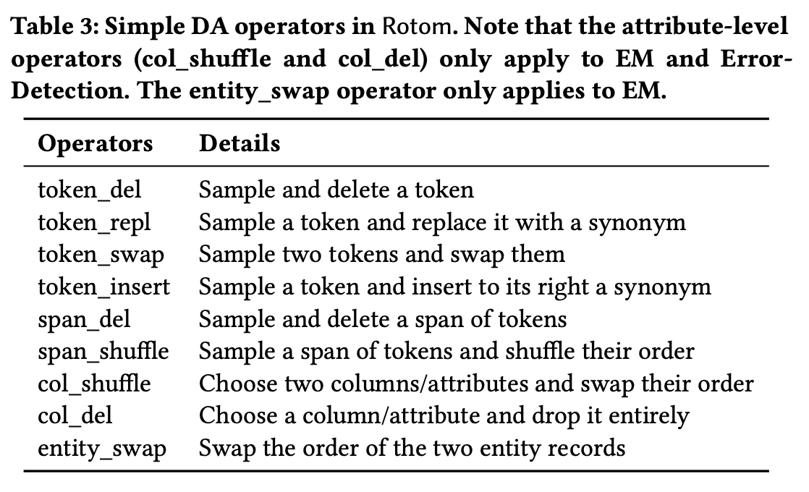

- Rotom 
    + 複数のdaを適用(InvDa)
    	* daは開発者がタスクに合わせて適宜追加することもできる
    + daデータのチェックを行い、品質の担保も行う(filtering, weighting)
    + ラベルなしデータにラベル付与することもできる
    

### 3.SEQ2SEQ DATA AUGMENTATION
**Seq2Seq**
- シーケンスを入力として新しいシーケンスをつくる
- テキストデータのda手法として使われてきた
- 元の配列に特定数の変換を行うものより、多様なデータを作り出せる
- ただし自然文以外のタスクでは、大規模corpusで学習したseq2seqモデルだと単語分布が合わないのでタスク固有のcorpusで訓練しないといけない  
            ↓  
「seq2seqに基づくDA手法InvDA」  

**課題**
- Seq2Seqの学習には、入力-ターゲット配列ペアのコレクションが大量に必要
- 良いシーケンスが必要
    + セマンティクスを保持
    + 入力と同じシーケンス分布
    + 入力シーケンスと可能な限り異なるシーケンス

**InvDa**   
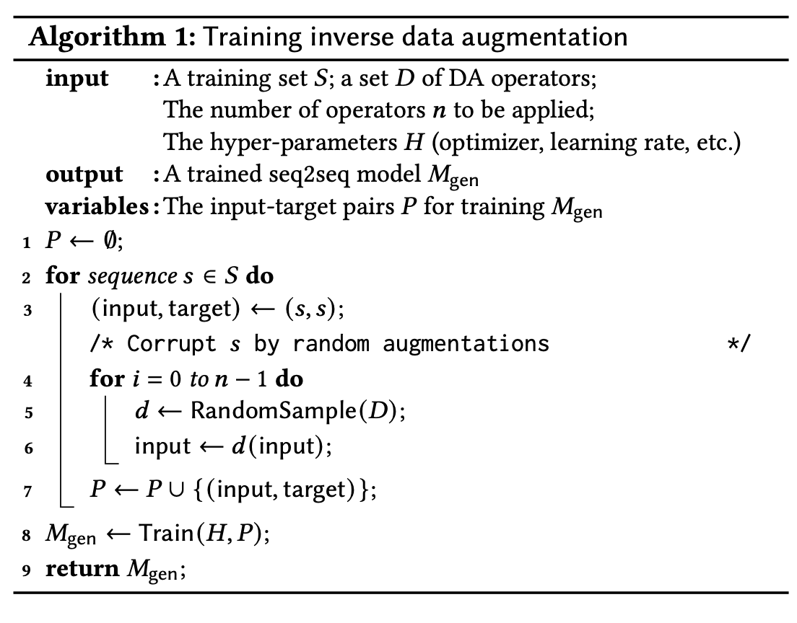  
- 破損した配列を反転したり復元する方法を学習
- 適用するDaの数を制御して、元データと離れたデータを作ることができる
- 良いシーケンス条件の2、3は満たす
- データ少ない時、seq2seqモデルをゼロから学習することはまだ実行不可能
    + 事前学習済みモデル、12層のT5-ベースモデルを利用

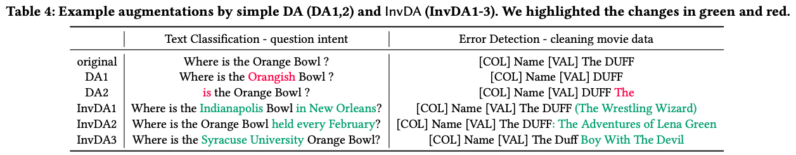    
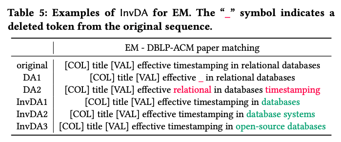

### 4.The filtering and weighting models
作成したDaデータがたどるステップ
- Daデータが使うか破棄するか決める分類器(filtering)
    + weighting処理だけで実現できそうだが、リソース節約のため
- Daデータの重み、重要度を付与する(weighting)

**Filtering Model**  
Daデータのうち、品質が低いものを弾くことを目的とする。  
リソース節約のためにも、軽めのモデルを利用。  
特徴量として、
- 元シーケンスをターゲットモデルに入れた時の出力 と Daシーケンスをターゲットモデルに入れた時の出力 の KLダイバージェンス
- ラベル

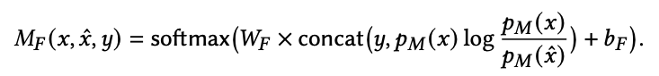    
Pm(): ターゲットモデル、ラベルを予測するモデル  
x: 元シーケンス  
x^: daシーケンス  
y: ラベル  

**Weighting Model**  
ターゲットモデルのlossを操作する。
難しいデータほど大きな重みとし、ターゲットモデルにより加味されるようにしたい。  

ターゲットモデルにおける重みつきloss  
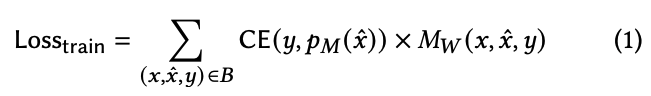  
CE: クロスエントロピー  

weighting model    
"難しい・複雑な"データであると決めることは、多くのテキスト判別能力が必要    
-> 事前学習した言語モデルを利用してdaシーケンスをエンコードし、全ベクトルを線形変換したものを利用。豊富な特徴量となる。  

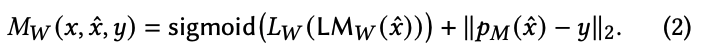    
LMw: 言語モデル    
Lw: 線形層    
∥Pm(x^)-y∥2: ターゲットモデルによるda予測ラベル と 真のラベル のL2距離    

どちらの項も間違えているデータほど値を大きくして、重視する。
学習初期は、左の項が不安定な値をとるため右の項によって間違った値はMwが大きくなるようにしてもらう。
学習が進んでいくとL2->0のため、 左側の項によって値が決まるようになる。
  
**Meta Training**  
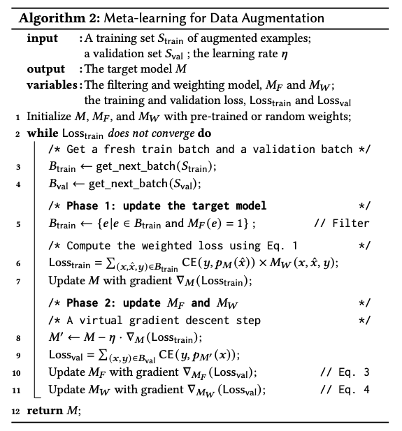    
評価データセットでの成績が良くなるよう、Loss valを入力する。

### 5.ROTOM FOR SEMI-SUPERVISED LEARNING    
Rotomフレームワークを半教師付き学習（SSL）に自然に拡張し、大量の非標識データを活用することができる。  
下記を行う。　　
- daによるラベル無しデータの増幅  
- ラベル付与  

以下で元の教師ありモデルのlossの置き換え。  

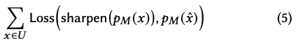  
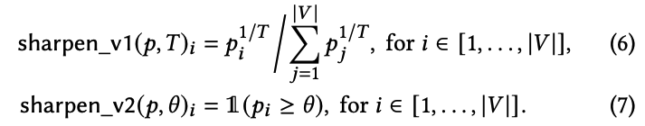   　　

6式: モデル出力の確率分布をone-hotのような分布になるように補正する式。Tが小さいほどone-hotぽい。(温度付きそふとまっくすみたいな考え方)  
7式: 擬似ラベリング。最大の信頼度が閾値より大きい場合、arg maxのクラスラベルを付与する。  　　

具体的にどう組み込むか  　　
- 5行目：学習バッチにラベルなしデータの追加
- 6行目：各例の重みを計算する際に、shapen(-)で推測されたラベルに置き換え

**全体図**  
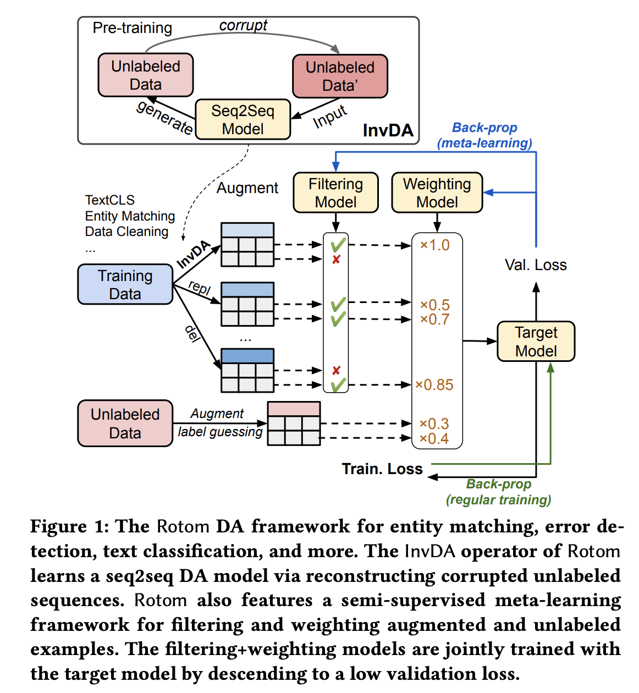　　

### 6.EXPERIME
エンティティマッチング（EM）、誤り検出（EDT）、テキスト分類（TextCLS）のベンチマークデータセットにおける実験. 

**手法**
- Baseline (RoBERTa/DistilBERT/BERT)
    + daデータなし。
    + 元のデータのみで事前に学習した言語モデル（LM）を微調整する。
- MixDA
    + 表3に示す単一のdaを適用する。各タイプのタスク（EM、EDT、TextCLS）に対して一般的によく機能するda手法で処理。
- InvDA
    + seq2seq InvDAを適用。InvDAに置き換えた以外はMixDAと同じ設定。
    + 1データにつき50のdaデータを作る
- Rotom
    + 元の学習例とInvDAとMixDAによって生成されたdaデータを組み合わせる。
- Rotom+SSL
    + 一様にサンプリングされた非ラベル付きデータを利用。

**データ**  
EM, EDT, TextCLSの標準的なベンチマークデータセットで評価  
各データセットは、異なるWebサイトからの製品または出版物のレコードのラベル付きペアで構成  
- EM: 一組のレコードが同じ製品/出版物を表しているかどうかを分類  
- EDT: スプレッドシートが与えられ、セルが誤りを含むかどうかを分類
- TextCLS: 感情分析や意図の分類など  
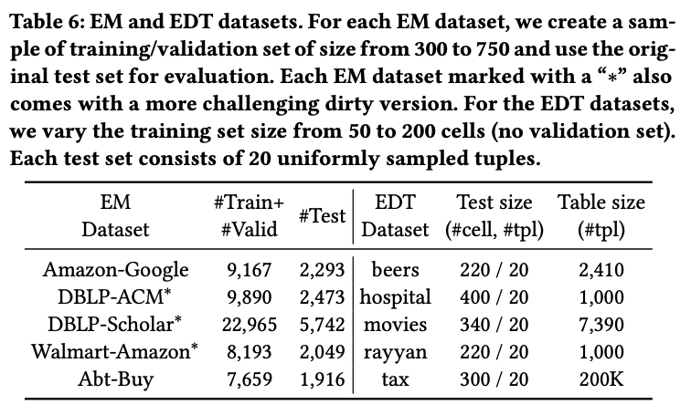  
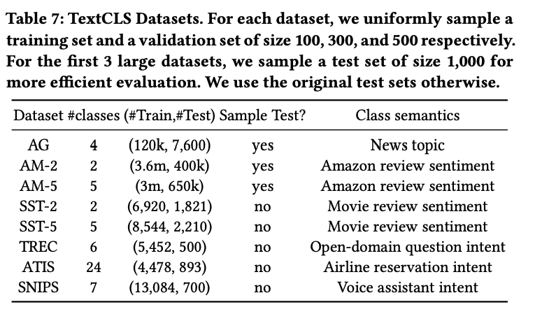

**結果(EM)**  
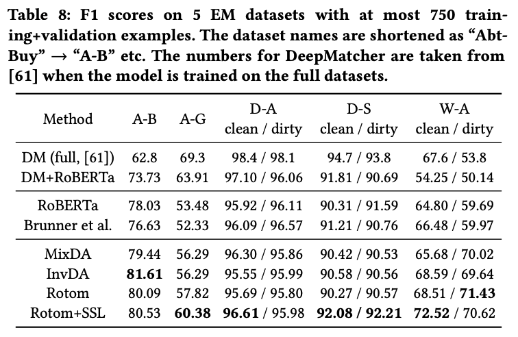  
- Rotom+SSLは、全データセットで学習したDMと比較して、わずか6.5%のラベルデータのみで勝った
- データセットによっては、最も優れたスコアを出したものもある

**結果(EDT)**  
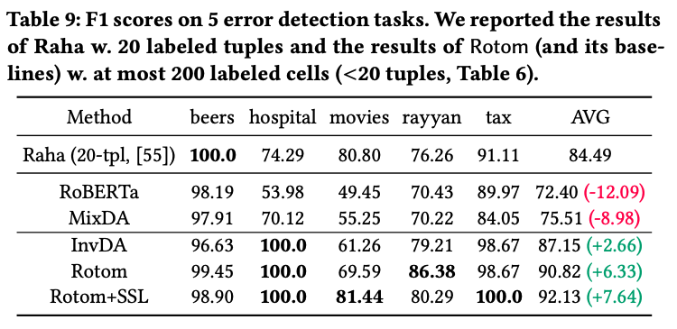  
- Rotom+SSLは4/5のラベルデータで優れたスコアを出した

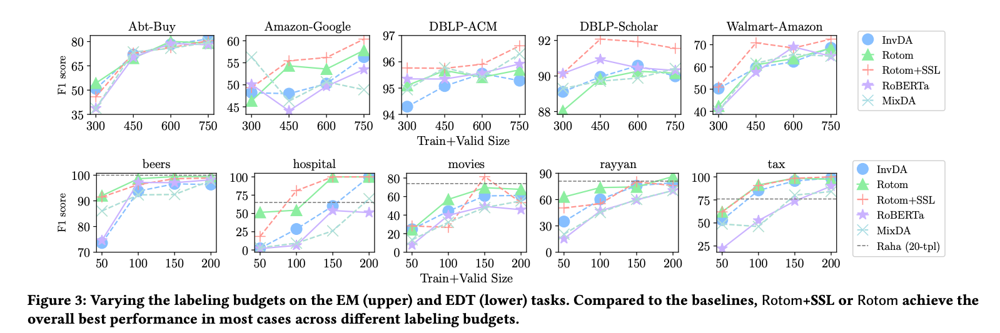  

**結果(TextCLS)**  
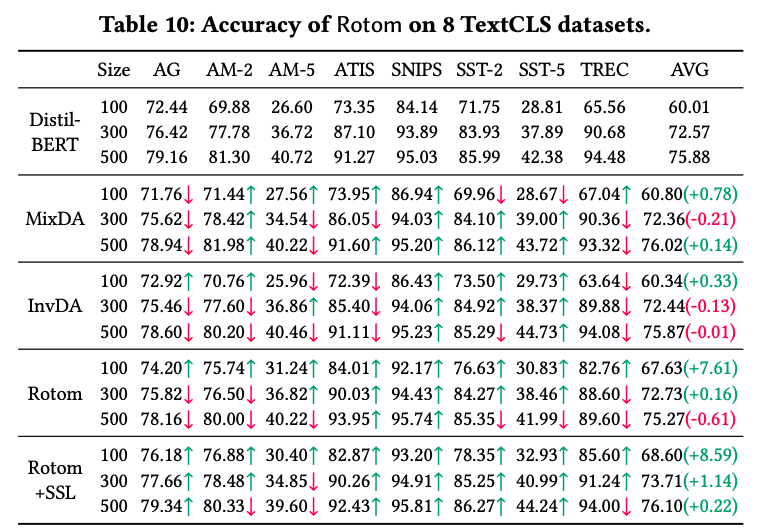  
- rotomはラベルデータsizeが小さくても優秀  
- MixDA > invDA のため、daデータの多様性を高めることはこのタスクでは役に立たなそう

**training time**  
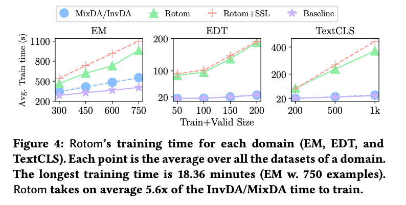
