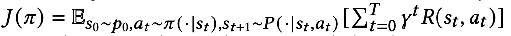

# 2021_An Adversarial Imitation Click Model for Information Retrieval
pdf : https://arxiv.org/pdf/2104.06077.pdf  
WWW 2021

## 著者 (所属)  

## どんなもの？ (解きたい問題)
- 新しいクリックモデルを提案
    + Adversarial Imitation Click Model (AICM)
- 模倣学習に基づいている
    + お手本(エキスパート)データ = ユーザのクリック として真似するように学習
    + GAIL(Generative Adversarial Imitation Learning)ベース

## 先行研究と比べてどこがすごい？
- 露出バイアスを軽減
- 精度が高い
- 入力データが悪くてもちゃんとクリック予測ができる

## 技術や手法のキモはどこ？
### 既存のクリックモデル
確率的グラフィックモデル（PGM）ベース
- ユーザー行動クリック、スキップなどを観測可能な状態かそうでないかで表現
- イベント間の依存関係を手動で設定する必要がある
- 単純化されすぎてユーザの行動の重要な側面を見落としてしまう可能性

NNベース
- ニューラル・クリック・モデル（NCM）
    + ユーザの行動を二値ではなく、ベクトルで表現
- クリック・シーケンス・モデル (CSM)、コンテクストウェア・クリック・モデル (CACM)
    + 複雑なモデル構造を利用して多くの情報を取り込み、表現力をさらに高めた
- 露出バイアスがある

### 模倣学習？
目的:お手本の行動(エキスパートデータ)を再現するポリシー𝜋𝜃(𝑎|𝑠)を学習すること

#### Behavior Cloning
- お手本(一連の状態と行動)を与えて、模倣できていたら報酬を与える学習法
- 状態sの条件でお手本と同じ行動aをする確率を最大化するパラメータθを見つける  

#### Inverse Reinforcement Learning（IRL、逆強化学習)
- お手本データから報酬関数を推定する。
- 最適となる報酬関数はたくさんあって、一意に決められなかったりする

#### Generative Adversarial Imitation Learning(GAIL、敵対的模倣学習)
参考：https://qiita.com/qiita_kuru/items/96dffa06d61774f6951c
- ポリシー𝜋𝜃(𝑎|𝑠)生成器を識別器𝐷𝑤(𝑠,𝑎)によって提供される報酬で訓練
- 識別器は渡されたデータが生成器によって作られたデータ or エキスパートデータかを判断
- 生成器は識別器を騙すために、よりエキスパートデータを再現できるθを探す

GAILの目的関数    

### 提案手法
ユーザー行動  
逐次的な意思決定プロセスと考える    

- 𝑞:クエリ
- 𝐷:ドキュメント集合
- T:ドキュメントの数
- C:クリックシーケンス

- State(s,状態)
    + ユーザの初期状態s0はクエリ𝑞で初期化
    + 状態𝑠𝑡は現在の文書d1,...,dtとクリックシーケンスc1,...,ct-1を含む
    + 𝑠𝑡 = {𝑞, 𝑑1, . . . , 𝑑𝑡−1, 𝑑𝑡, 𝑐1, . . . , 𝑐𝑡−1}
- Action(a,行動)
    + アクション𝑎𝑡は、順位tの文書に対するユーザの行動
    + クリックモデルなので𝑎𝑡 = 𝑐𝑡
    + ユーザがアイテムをクリックするか否かはポリシー𝜋𝜃(𝑎𝑡|𝑠𝑡)に基づく

#### 構成
- クエリ、ドキュメント、アクション表現のための埋め込み層
- ユーザークリックを生成する生成器 𝜋𝜃(𝑎|𝑠)
- 生成されたユーザークリックと、本当のクリックデータを判別する識別器𝐷𝑤 (𝑠, 𝑎)  

#### 生成器
𝜋𝜃(a|s)を生成するプロセス
- 1)クエリ𝑞で初期化. クエリ以外は0が入る
- 2)rank1. 現在のドキュメントv𝑑、それに対するv𝑣が入る. 一つ前のクリックはないので0. 𝜋𝜃(𝑎1|𝑠1)=Softmax(Linear(h1))で行動を決める
- 3)2で生成されたクリックを使って遷移
- 4)rank t> 1 の場合、2と3を繰り返し行う    

#### 識別器
生成されたクリックと、本当のクリックデータを判別  
クリックは 0 ~ rankTまでの塊で評価される  
GRUを利用    

#### トレーニング
生成器と識別器は、収束するまで以下の手順で更新  

1)𝜋𝜃(a|s)とエキスパートデータから差分をサンプリングし、勾配(式)で識別器パラメータ𝑤を更新  

2)識別器𝐷𝑤(𝑠, 𝑎)が得られるたびに、Proximal Policy Optimization (PPO)を使ってgeneratorを更新  

  
γ: 割引係数。将来の報酬をどれだけ重視するか。  
Q: 価値関数。その状態でその行動をとる価値。  
logDwが報酬関数で、ディスカウントファクター 𝛾で重み付けした和がQ  

## 実験
### 設定
データ
- 中国の商用検索エンジンSougou.comが2019年に公開したオープンな検索ログデータセット(TianGong-ST dataset)
- トレーニングセット、検証セット、テストセットに8：1：1の割合で分割済み
- 人が注釈をつけた関連性ラベルを持つ2,000のクエリセッションも  

比較手法
- PGM ベースの手法
- NN ベースの手法

評価指標
- 3つのよくある指標(LL、PPL、NDCG)
- 本論文で提案する指標(Reverse PPL、Forward PPL)  
  
PPLはランクごとに計算して、平均値を算出  
PPLが小さく、LLが大きいほど予測性能が高いことになる

### 1. クリック予測タスクと関連性推定タスク
- PGMベースよりNNベースが良い感じ
- クリック予測タスク、関連性推定タスクともにAICMが最優秀  

### 2. 分布のカバー率
本論文で提案する指標(Reverse PPL、Forward PPL)について  
クリックシーケンス全体の品質を測定するタスクが必要.(LLやPPLでは測定できない)  
-> 生成クリックシーケンス全体を利用して代理モデルを学習し、そのモデルを評価    

代理モデルの設定
- UBM と NCM のモデルを作成
- トレーニングセットと同様のサイズのクリックデータセットを生成するために，テストセットの各クエリについてクリックを独立して7回サンプリング  

- UBM samplesは1の結果ではNNベースのものと差分がなかったのに、今回は結構差が出てる
    + 全体の分布カバレッジで評価するとそこまでよくない
- AICMは一番優秀でした

分布的カバレッジのための視覚化  
生成クリックデータセットから，代理NCMによって学習されたドキュメントエンベディングとGRUのh層ベクトルのt-SNE投影  

- AICMクリックデータ由来のモデルのプロットが一番realデータに近い

### 3. ランク付けされていないドキュメントセットでクリック推定
各学習済みモデルにランキングをシャッフルしたドキュメントセットをわたし、クリック生成  
生成クリックに基づいて代理モデルを学習させ、評価  
  
- シャッフルしてるのによくなっているように見える
    + NNベース: 汎化性能がついた
    + AICM: GAILの特性として、全体的な分布を捉えるため順番が入れ替わっても問題ない
    
### 4. AICMの特性や性能
#### 事前学習について
  
- 事前学習が不十分 or なしでも最終的に収束

#### 学習戦略について
- g_step: 生成器の学習
    + k回学習
    + m個のクリックシーケンスを作る
- d_step: 識別器の学習
    + 各クリックシーケンスに対してn回学習
    + 全部でm x n回学習 
    
  
- ライバルが優秀すぎるともう片方はうまく成長できない
- 過学習にも注意

#### ディスカウントファクター 𝛾 について
  
- 最良のパフォーマンスは， 𝛾 = 0.1
- 将来のデータはあまり考慮に入れなくて良いことになる
- ポジション・バイアスによる影響
