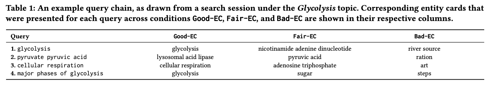

# 2021_The Impact of Entity Cards on Learning-Oriented Search Tasks
pdf : https://dl.acm.org/doi/pdf/10.1145/3471158.3472255   
ICTIR 2021 (SIGIR系列のカンファレンス。情報検索の理論・概念に関するものを扱う)

## 著者 (所属)

## どんなもの？ (解きたい問題)
- Search as Learning (SAL) = ユーザーが特定の情報ニーズ、または目的に関する知識を得ること(学習としての検索)
- EntityCard(KP、ナレッジパネル)を表示することはSAL領域においてユーザに何らかの影響をもたらすか？を研究
    + 被験者に学習・検索を行ってもらい、調査

## 先行研究と比べてどこがすごい？
- SAL分野で初めてEntityCardに着目した

## 技術や手法のキモはどこ？
### ECについての先行研究
#### ユーザの検索行動に与える影響についての研究  
- ユーザはクエリに関連のないECより関連のあるECでより長く滞在
- 関連のないECのときAlgo部分での滞在時間が伸びる
- 目的に関連したECとインタラクト（クリックやマウスホバー）する
- 検索結果ページにECが存在すると、ユーザのオーガニック検索結果へのエンゲージメントが高まる

#### ECの生成と提示の方法についての研究  
- ユーザは静的な概要文よりも動的な概要文を好む(クエリに依存した概要文を生成するらしい)
- 健康関連のEC
    + 基本的にECを吟味してからAlgoに行く
    + ECの提示枚数より関連のあるECがあるかどうかの方が重要
    + 複数枚のECを出すとユーザの意思決定までの労力が小さくなる(クリック数が少なくなる)

#### どのECを表示するかの研究
(※トレーニング用に大規模なクエリログを用意できない場合)  
基本指針：クエリに対して出力される上位ドキュメントのキーワードにマッチするECを出す。  
関連キーワードの抽出方法
- コーパスに依存するアプローチ(クエリに対して予め関連ワードリストなどを持っておくなど)
- 依存しないアプローチ
    + (i) グラフベースの言語表現を利用してキーワードを検出するグラフベースの手法
    + (ii) 埋め込みベースの手法
    + (iii) テキストの統計的特徴に依存する統計ベースの手法

### SALについての先行研究
- 学習指向の検索タスクを受けた人がどのように行動するか
- ユーザの学習行動をどうやって測定するか
    + 検索セッション内での専門知識の流れ(検索クエリの変化？)を研究
    + 視線の動きのパターン、保存した文書や開いた文書、クリックなど
- 検索エンジンが、フォーマル、インフォーマルを問わず、ユーザの学習をどのように支援できるか
- 専門家と非専門家の検索戦略の違い

## 実験
### ECの実装について
オープンソースSearchXを利用した実験  
最低限の検索機能とログ機能  
ECは実装されていない -> 筆者らでEC実装  
    
  
- サジェスト(Bing Autosuggest API2)
- 1ページあたり10個の検索結果(Bing Search API)
- ドキュメントのブックマークが可能
- 最近検索したクエリboxがある
- 経過時間が確認できる

 
- image
    + from Bing Image Search API
- タイトル
- Wikipediaベースの概要
- 基本情報
    + 数や内容はDBPediaのオープン・ナレッジ・グラフに依存
    + 基本情報のうち全ECの20%未満しか出現しない項目は削除(目の色とか) 
    
#### 実験で使用するECランカー
- クエリとドキュメント・スニペットをランカーに入力
- これらより関連キーフレーズトップ20を抽出
- 各キーフレーズをWikipediaページにリンクさせる(TagMe API)
- リンクしたWikipediaよりECが一意に決まる

キーフレーズの抽出方法はEmbedRank  
Yake、RaKUn、EmbedRankの3手法より、それぞれキーフレーズ抽出・ECリンクしてクエリ-ECセットを作成。  
クエリ-ECセットが情報ニーズに合っていると回答された率が高かったEmbedRankを採用。

#### ECステータス  
- Good-EC: 1位のECを提示
- Fair-EC: 5位のECを提示
- Bad-EC: 20位のECを提示
- ECなし
   

### 実験内容
- 被験者に検索させるトピック: 解糖系(Glycolysis), 放射能(Radioactive Decay), 量子ビット(Qubits)
    + 先行研究で利用された10個のトピック(各トピックに10個の参考語彙も付属)のうちECがたくさん表示できる上位3件
- 被験者に事前テストと検索後テストをしてどれだけ学習できたか測定
- 詳細手順
    + 3つのトピックのプレテスト
    + 被験者を事前知識が最も少ないトピックに割り当てる
    + 検索作業(ECのステータスはランダム、最短でも15分間は検索しないといけない)
        + wiki系ページはAlgoから除外
    + テスト

### 結果
※学習利得のスコア(𝑅𝑃𝐿): 最大で得られるはずの知識量のうち実際に得られた知識量  
小さいアルファベットはどの群と比較して優位かを示す

  

- 学習量に影響を与えるか
    + ECありなしで学習量に大きな差は見られない
    + トピックによってはBad-ECが学習阻害になりうる  
-> ECの存在は学習効果の向上にはつながらない

- 検索行動に影響を与えるか
    + 滞在時間について
        * ECがあると平均セッション時間が長くなる
        * ECがあるとドキュメントでの滞在時間が長くなる
        * ECの質が上がるとクエリあたりの滞在時間が長くなる
    + インタラクションについて
        * マウスホバリング回数はECの質に関係しない
        * ECがないとドキュメントの閲覧数が増える
    + クエリについて
        * GoodなECほど調べ直す回数が少ない
        * ECに含まれるワードを利用して再検索する  
-> 検索行動に様々な次元（滞在時間や検索セッションの継続時間など）で大きな影響を与える。
        
ユーザが検索したクエリの中にエンティティカードの用語が出現する割合を調べた  
 
- 事前に観察されたスニペットに含まれる単語が再検索に使われる割合
- 　　　　〃　　　ドキュメント　　　　〃
- 　　　　〃　　　ECのタイトル　　　　〃
- 　　　　〃　　　ECの概要　　　　　　〃  
->  ユーザはECの品質を精査して、クエリチェーンに利用

